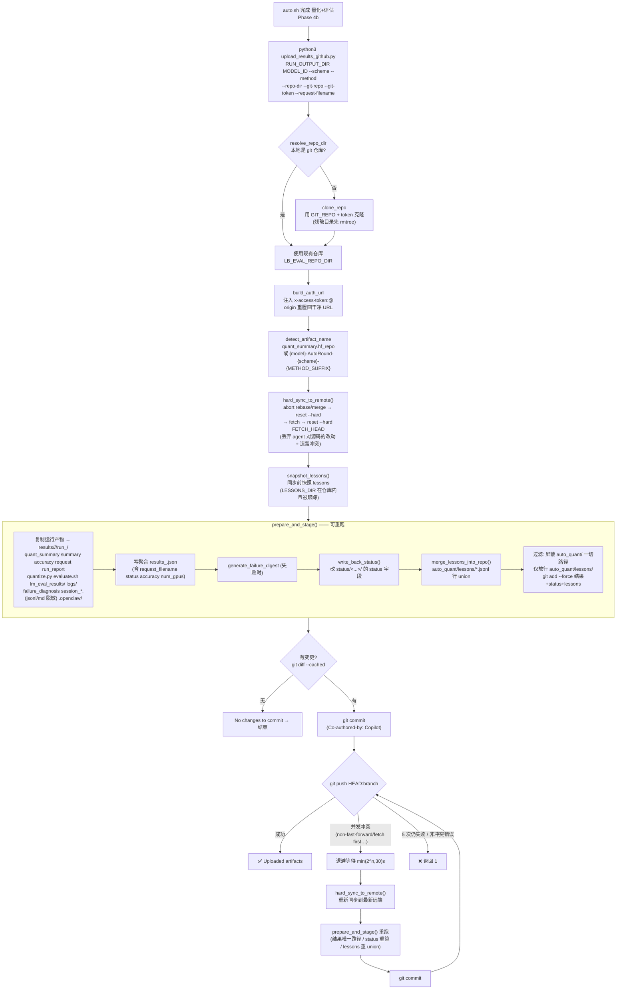

# GitHub 结果回传流程（`upload_results_github.py`）

lb_eval 在量化+评估完成后，如何把结果、日志、状态回传到 lb_eval GitHub 仓库。
由 `auto_quant/auto.sh` 的 **Phase 4b** 调用 `auto_quant/upload_results_github.py`。

> HF 权重上传（`upload_model_hf.py`）是另一条独立的线，本文只讲 GitHub 结果回传。

---

## 总览流程图



---

## 关键设计点

### 1. 触发与容错
- 入口：`auto.sh:413`，在 HF 权重上传之后。
- 末尾 `|| log_warn "GitHub upload failed"` → **上传失败不影响整条 pipeline 的成败**，仅告警。
- 关键参数：`RUN_OUTPUT_DIR`(运行产物目录)、`MODEL_ID`、`--scheme/--method`、`--repo-dir`(=`GIT_RESULTS_REPO_DIR` 或 `SCRIPT_DIR/lb_eval`)、`--git-repo/--git-token`、`--request-filename`。

### 2. 仓库定位与认证
- `resolve_repo_dir`：优先 `--repo-dir`（若已是 git 仓库）→ `--clone-dir` → 默认 `auto_quant/lb_eval`；不是仓库则用 `GIT_REPO` 克隆。
- `build_auth_url`：`https://x-access-token:<token>@github.com/...`；克隆后 origin 重置回干净 URL（token 不落盘），pull/push 临时用带 token 的 URL。

### 3. 命名规则
`detect_artifact_name` 优先取 `quant_summary.hf_repo` 的仓库名；否则拼
`{model}-AutoRound-{scheme}-{METHOD_SUFFIX}`，其中 `METHOD_SUFFIX`：
`TUNING→Tuning`、`MODEL_FREE→ModelFree`、其余→`RTN`。

### 4. 落盘位置（仓库内）
```
results/<org>/<artifact>/results_<ts>.json        # 聚合元数据
results/<org>/<artifact>/run_<ts>/                # 本次运行全部产物
status/<...>/<request_filename>                   # 仅更新 status 字段（排行榜读取）
auto_quant/lessons/*.jsonl                        # lesson 增量（行 union）
```

### 5. 状态派生（`derive_pipeline_status`）
| 条件 | 状态 |
|------|------|
| `quant_summary.status == failed` | Quant Failed |
| `accuracy.status == failed` 或 **任一 task acc == 0** | Eval Failed |
| quant + eval 都 success | Finished |
| 其它 | Partial |

该 `status` 就是排行榜 UI 显示的状态（前端读取同一仓库的 `status/` 和 `results/`）。

### 6. 冲突鲁棒性（重点加固）
- **暂存前** `hard_sync_to_remote()`：abort rebase/merge → `reset --hard` → fetch →
  `reset --hard FETCH_HEAD`。清掉上次遗留的 unmerged 状态，并**丢弃 agent fix-loop 对
  `auto_quant/` 源码/脚本的改动**（这些绝不提交）。
- **push 重试**：并发冲突时 → hard_sync 到最新远端 → `prepare_and_stage()` 重跑 →
  重新 commit → 重推（最多 5 次，指数退避）。之所以天然收敛：
  - `results/` 用唯一 `run_<ts>` 路径，永不冲突；
  - `status/` 每次基于**最新远端**重算写回；
  - `lessons/` 每次对最新远端做**行 union**（保留并发 run 追加的 lesson）。

### 7. auto_quant 提交策略
- **代码/脚本**（`phases/*.sh`、`quantize.py` 等 agent 改动）→ **绝不提交**（被 `reset --hard` 丢弃 + `_blocked_path` 过滤）。
- **lessons**（`auto_quant/lessons/*.jsonl`）→ **提交**（sync 前快照，sync 后行 union 合并回去）。

### 8. 脱敏
`copy_file_sanitized` / `sanitize_secrets` 对 session 文件里的 token 做正则打码后再入库。

---

## 数据流小结

```
RUN_OUTPUT_DIR (容器内运行产物)
        │ 复制
        ▼
git 仓库 results/  ──┐
status/ (改状态)   ──┼──► git commit + push ──► 排行榜前端读取 status/ + results/ 展示
auto_quant/lessons ──┘
```
